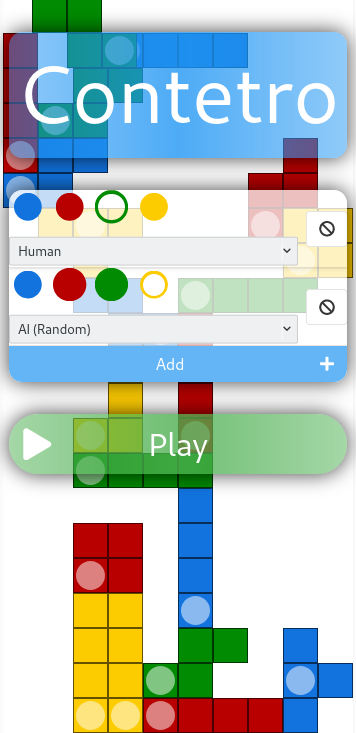
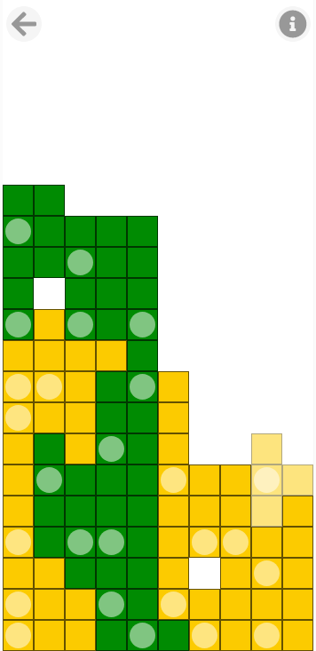
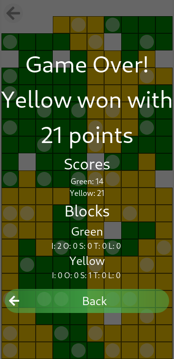

# Contetro

Contetro is a local 2-4 player turn based game about connecting tetrominos.

You can play it against yourself or friends in [your browser](https://hizoul.github.io/contetro).

In case the game sparks your interest you can read a lot of details about it in my [master thesis](https://github.com/Hizoul/masterthesis) which details game playing strategies, analysis and AI approaches.

# Screenshots

